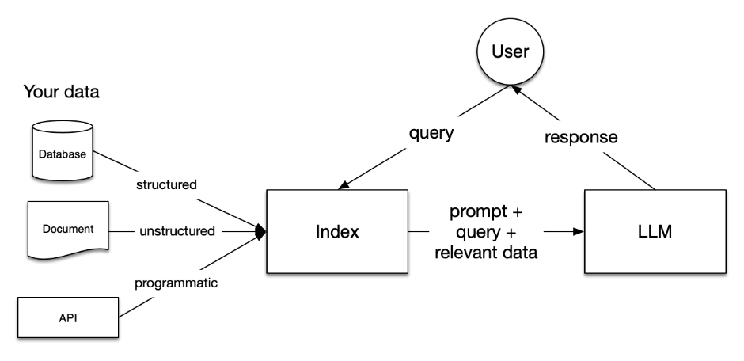

# rag-aja

## RAG using llama-index and streamlit.

Query your search and get the explanation from inputted document.

RAG (Retrieval Augmented Generation) is a combination of LLM and embedding model to query an additional data like internal documents, texts, books and more.



Your data will be chunked into chunks/nodes and will be ingested into the vector database. Later your query or question will be searched to the vector databse and will be brought to the table with the help of LLM.

# To run

Ingest your data first by doing


```
python ingestion/iterate_metadata.py
```

# Models Spec

- LLM : gemini or gpt-4o-mini
- Embedding :  Model uses sentence-transformers/all-MiniLM-L6-v2


## To run:

```
streamlit run dashboard.py
```

# To use docker

```
cd rag-aja
docker build -t linkaja .
docker run -d --name linkaja_container -p 8501:8501 linkaja
```

## Preprocessing Step

- Assumption : There are several parts that dont have topik or level, so we assume these data points have those topic and level

## Code Formatter:

- Black – Automatically formats code according to PEP 8 standards

## Evaluation Concept

- Response Evaluation
    - Faithfullness : Measures if generated response matches any source chunks/nodes, make sure there's no hallucination. Can be said whether the transformation of given context to the answer is "faithful" or no.
    - Relevancy: Evaluates the relevance of the answer to the retrieved context; Measures if the response + source nodes match the query.
    - Correctness: Is the expected response and generated response relevant?

- Retrieval Evaluation
    - MRR: Can be 1/1, 1/2, 1/3 etc (based on the rank of the related retrieved chunk of chunks retrieved)
    - Hit Rate: Can be 1 (if at least 1 chunk/node retrieved of chunks retrieved) or 0

## Evaluation Strategy

Evaluation using Notebook in the notebooks/evaluation...ipynb. Evaluation uses gpt-4o-mini to asses the model (can be gemini or gpt-4o-mini for the RAG model).

Soon:

- Using tox to give statistic about evaluation metrics result
- Evaluation using RAGChecker
- Research for metrics improvements

```
tox
```

And then see the summary.log for the mini report

# Embeddings Concept

Embedings basically is a vector representation of words and sentences. Vector embeddings are a way to convert words and sentences and other data into numbers that capture their meaning and relationships. There are several types of embeddings, among the well-known are word embeddings and sentence embeddings. 

# References

- https://docs.llamaindex.ai/en/stable/understanding/rag/
- https://docs.llamaindex.ai/en/stable/examples/cookbooks/oreilly_course_cookbooks/Module-3/Evaluating_RAG_Systems/#relevency-evaluation
- https://medium.com/@med.el.harchaoui/rag-evaluation-metrics-explained-a-complete-guide-dbd7a3b571a8